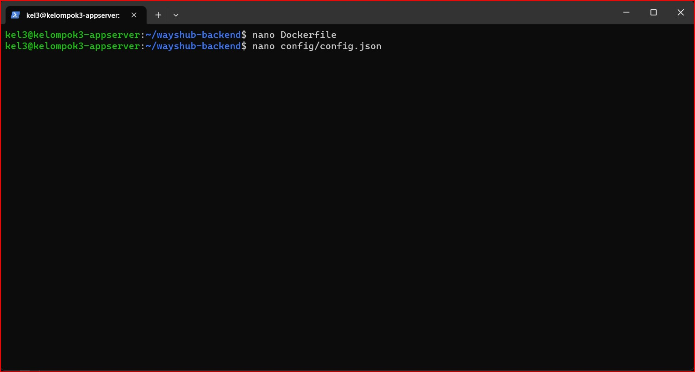

# Kelompok 3
Anggota
- Muhamad Abdul Zafar Assidiq
- Salman Alfarisi
- Muhammad Ilham 
***

# Docker 
Docker adalah platform perangkat lunak yang memungkinkan Anda untuk membuat, mengemas, dan menjalankan aplikasi secara konsisten di lingkungan yang terisolasi yang disebut "kontainer". Kontainer adalah unit terisolasi yang menjalankan perangkat lunak dan semua dependensinya, termasuk sistem operasi, perpustakaan, dan kode aplikasi. Docker memanfaatkan teknologi containerisasi yang sudah ada di dalam kernel Linux, seperti namespaces dan cgroups, untuk membuat dan mengelola kontainer.

## Requirements
- Buat 3 vm dengan spesifikasi sebagai berikut: 

| VM       | CPU     | RAM     | Storage |
|----------|---------|---------|---------|
| AppServer      | 2 Core  | 8 GB    | 100 GB  |
| Gateway        | 4 Core  | 16 GB   | 200 GB  |
| CI/CD          | 8 Core  | 32 GB   | 500 GB  |


# Setup Docker 
Hal pertama setelah membuat vm app server ikuti petunjuk disini [Docker](https://docs.docker.com/engine/install/ubuntu/)


```
sudo apt-get update
sudo apt-get install ca-certificates curl gnupg
```


> Jalankan perintah diatas ini atau bisa copy text nya 


> Step ke dua masukan gpg key nya kalian bisa copy di bawah ini

```
sudo install -m 0755 -d /etc/apt/keyrings
curl -fsSL https://download.docker.com/linux/ubuntu/gpg | sudo gpg --dearmor -o /etc/apt/keyrings/docker.gpg
sudo chmod a+r /etc/apt/keyrings/docker.gpg
```

> Buat seperti ini untuk menyiapkan repository nya, setelah membuat repository lakukan `sudo apt-get update`

```
echo \
  > "deb [arch="$(dpkg --print-architecture)" signed-by=/etc/apt/keyrings/docker.gpg] https://download.docker.com/linux/ubuntu \
  > "$(. /etc/os-release && echo "$VERSION_CODENAME")" stable" | \
  > sudo tee /etc/apt/sources.list.d/docker.list > /dev/null
```


> Baru disini instalasi docker dengan perintah 

```
sudo apt-get install docker-ce docker-ce-cli containerd.io docker-buildx-plugin docker-compose-plugin
```


> selanjutnya jalankan `docker -v` , kemudian setup untuk user root agar kita tidak perlu menggunakan sudo lagi saat menjalankan docker 

```
sudo usermod -aG docker (user)
```


> keterangan : perintah di atas ini adalah suatu perintah untuk mengizinkan user yang digunakan agar dapat menjalankan perintah docker tanpa menggunakan perintah sudo.

# Deploy Aplikasi On Top Docker

**Hal pertama harus mensiapkan aplikasi yang akan di deploy docker nya disini sudah disiapkan aada backend dan database nya**

```
git clone https://github.com/dumbwaysdev/wayshub-frontend
```

> Jika sudah lakukan cek dengan `ls` ini akan menampilkan perintah kalau aplikasi frontend sudah ada


> Sekarang intergrasikan si fronted agar tersambung oleh backend dengan masuk ke file api.js `cd wayshub-frontend/src/config/api.js` jika sudah kita akan membuat file Dockerfile di dalam wayshub-frontend


>Ini tampilan untuk di dalam api.js disini ubah dengan domain yang akan kita buat untuk backend


> Dan ini untuk scrript Dockerfile nya selanjutnya kita akan masuk konfiurasi database

## Database
**Sekarang buatlah di luar frontend file compose-mysql.yml**


> Jika sudah jalankan perintah `docker compose -f compose-mysql.yml up -d` 


> Selanjutnya masuk kedalam mysql menggunakan bash


**Backend**

> selaanjutnya clone backend nya ini link nya yang bisa di gunakan 

```
git clone https://github.com/dumbwaysdev/wayshub-backend
```



>selanjutnya sama seperti front end tapi disini yang di edit bukan src nya tapi langsung edit `nano config/config.json`, jika sudah lanjutkan membuat dockerfile di dalam wayshub-backend.


> Username dan psw di isi dengan username myasql yang udah dibuat di bash sebelumnya


> di sini sedikit beda sama di frontend disini tambahkan yang kalian butuhkan 

**Docker Compose** 

> Disini kita akan membuat docker-compose.yml setelah itu menjalankan untuk isinya seperti ini 


> Setelah membuat jaalan kan perintah ini.

**Docker Push Image**


>Masuk ke docker login jika diminta password dan username silakan masuk 

```
docker tag kel3-frontend zsikelompok3/wayshub-frontend
```


```
docker push zsikelompok3/wayshub-frontend
```


>lalu masukan perintah diatas 

# Konfigurasi Reverse Proxy
>Kemudian masuk ke`cd /etc/nginx` dan buat folder dengan nama apapun lalu buat konfigurasi untuk jenkins ,fronteb,backend setelah sudah semua pasangkan certbot 


# Hasil


