# Jenkins Top On Docker 
- Pertama buat docker-compose lalu jalankan docker compose nya 
```
version: '3.8'
services:
   jenkins:
      image: jenkins/jenkins:lts-jdk11
      container_name: jenkins
      restart: always
      privileged: true
      user: root
      ports:
         - 8080:8080
         - 50000:50000 
      volumes:
         - ~/jenkins:/var/jenkins_home
```

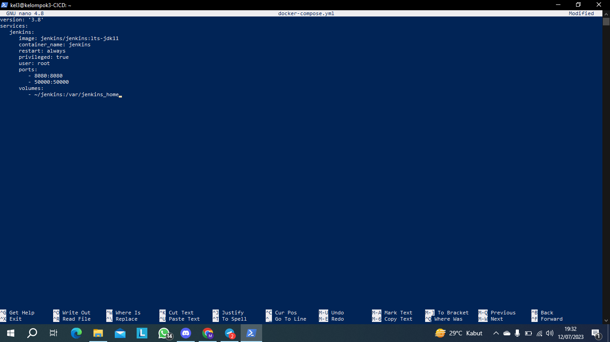
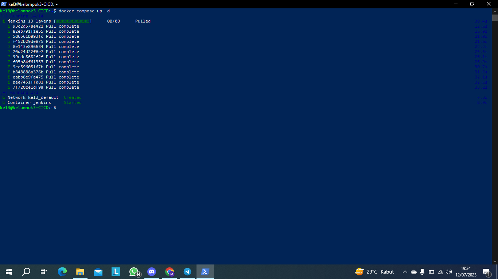

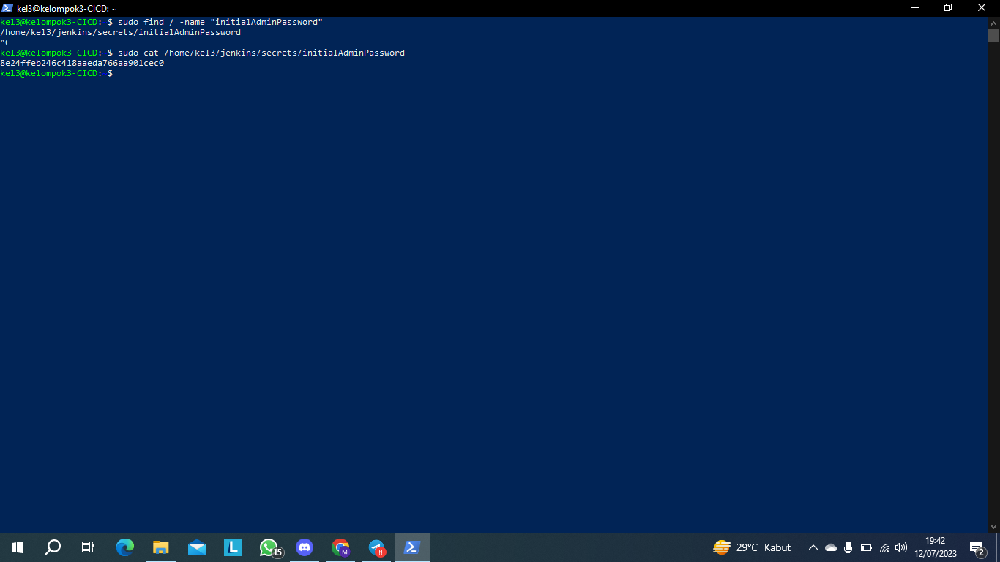
> perhatian: Jika kalian ga tau dimana posisi penimpanan password nya

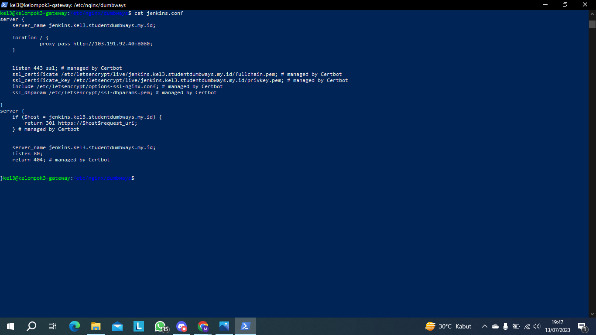
>jika sudah mari kita atur untuk reverse proxy nya biar bisa diakses dengan domain yang kita mau

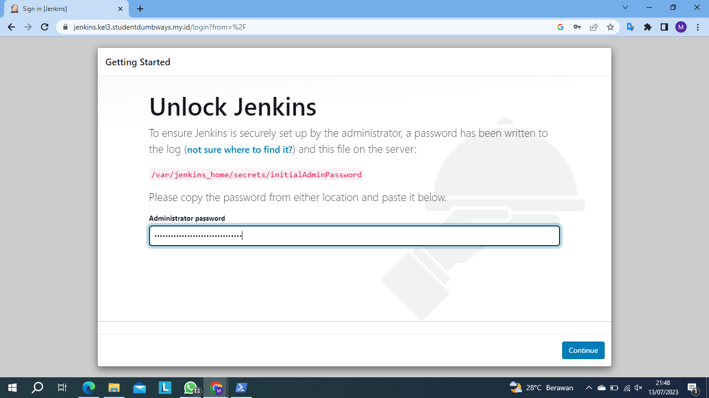
> Jika sudah ketemu password nya paste kesini 

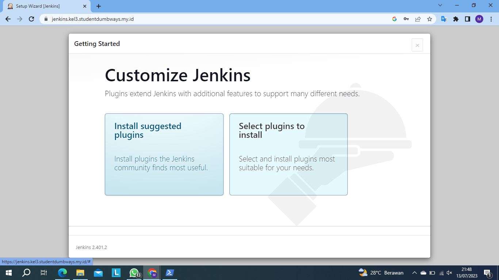 

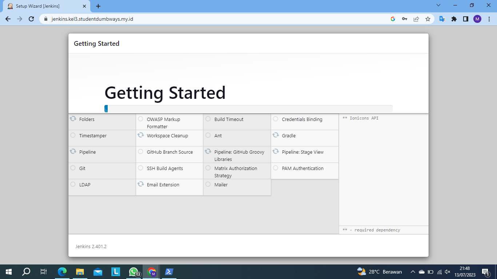
> setelah memilih plugin akan lanjut seperti ini dan kita harus menunggu sampai selesai

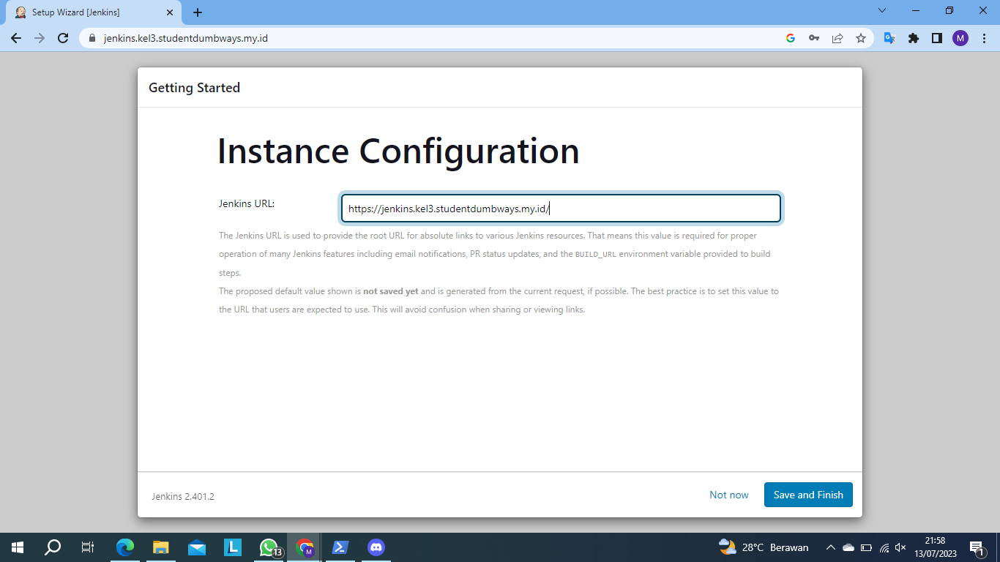
> Masukan domain yang udah kita buat di gateway vm

# Menghubungkan Jenkins Dengan Server
- Kemudian Konfigurasi Manage Credentials dan hubungkan Jenkins dengan VPS server dengan menambahkan ssh-keygen.
> public key dimasukan di dalam authorized keys.
private key diletakan pada user Credentials.

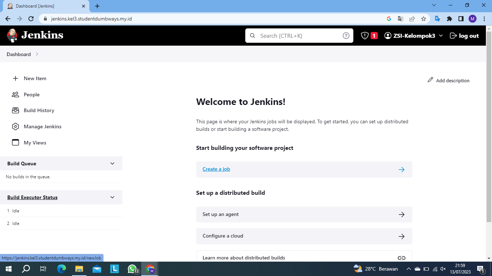
>Jika sudah pilih manage jenkins

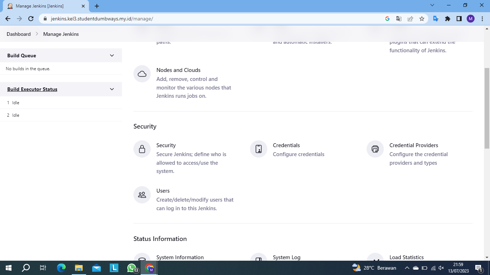
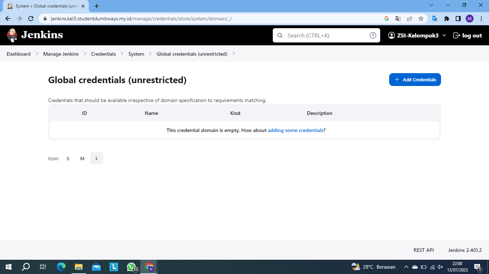
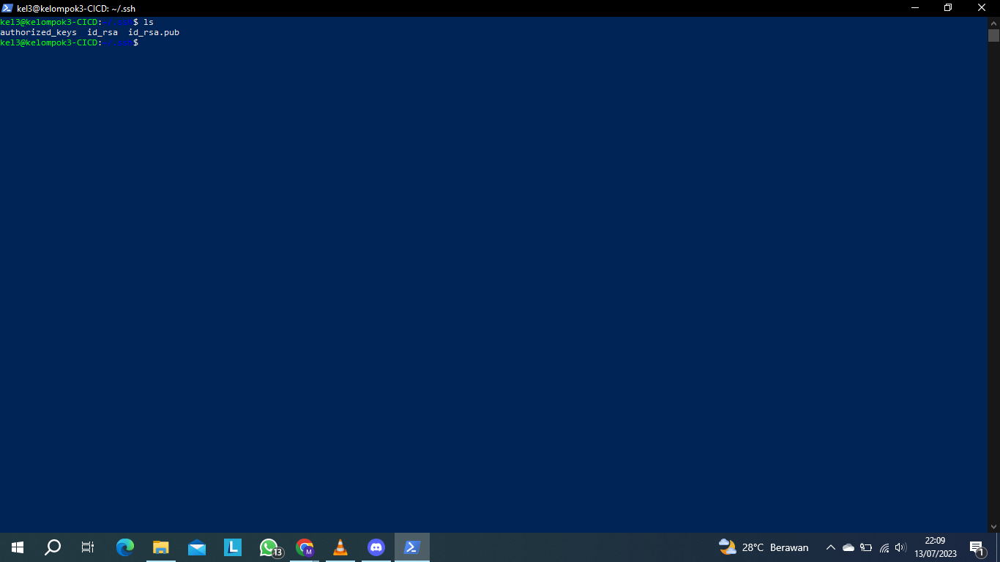

- tambahkan ssh dan discord notifer, discord untuk kalau ada eror atau berhasil build ada info yang masuk di discord kita 


# Membuat File Jenkinsfile di frontend dan backend
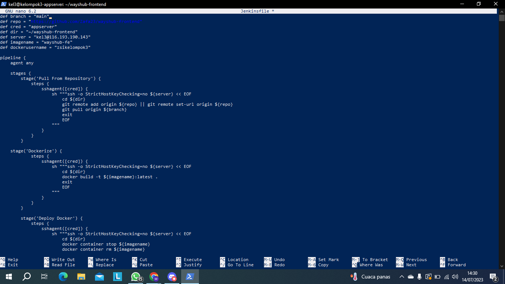
> Selanjutnya buat Jenkinsfile, dan masukan seperti diatas ini

`frontend`
```
def branch = "main"
def repo = "https://github.com/Zafa23/wayshub-frontend.git"
def cred = "appserver"
def dir = "~/wayshub-frontend"
def server = "kel3@116.193.190.143"
def imagename = "wayshub-fe"
def dockerusername = "zsikelompok3"

pipeline {
    agent any

    stages {
        stage('Pull From Repository') {
            steps {
                sshagent([cred]) {
                    sh """ssh -o StrictHostKeyChecking=no ${server} << EOF
                        cd ${dir}
                        git remote add origin ${repo} || git remote set-url origin ${repo}
                        git pull origin ${branch}
                        exit
                        EOF
                    """
                }
            }
        }

    stage('Dockerize') {
            steps {
                sshagent([cred]) {
                    sh """ssh -o StrictHostKeyChecking=no ${server} << EOF
                        cd ${dir}
                        docker build -t ${imagename}:latest .
                        exit
                        EOF
                    """
                }
            }
        }

        stage('Deploy Docker') {
            steps {
                sshagent([cred]) {
                    sh """ssh -o StrictHostKeyChecking=no ${server} << EOF
                        cd ${dir}
                        docker container stop ${imagename}
                        docker container rm ${imagename}
                        docker run -d -p 3000:3000 --name="${imagename}"  ${imagename}:latest
                        docker container stop ${imagename}
                        docker container rm ${imagename}
                        exit
                        EOF
                    """
                }
            }
        }

        stage('Push to Docker Hub') {
            steps {
               sshagent([cred]) {
			    sh """ssh -o StrictHostKeyChecking=no ${server} << EOF
				    docker tag ${imagename}:latest ${dockerusername}/${imagename}:latest
				    docker image push ${dockerusername}/${imagename}:latest
				    docker image rm ${dockerusername}/${imagename}:latest
				    docker image rm ${imagename}:latest
				    exit
                    EOF
			"""
		        }
            }
        }
    }
}
```


`backend`
```
def branch = "main"
def repo = "https://github.com/myayangs/wayshub-backend.git"
def cred = "appserver"
def dir = "~/wayshub-backend"
def server = "kel1@103.13.206.133"
def imagename = "wayshub-be"
def dockerusername = "myyngstwn"

pipeline {
    agent any

    stages {
        stage('Pull From Repository') {
            steps {
                sshagent([cred]) {
                    sh """ssh -o StrictHostKeyChecking=no ${server} << EOF
                        cd ${dir}
                        git remote add origin ${repo} || git remote set-url origin ${repo}
                        git pull origin ${branch}
                        exit
                        EOF
                    """
                }
            }
        }

    stage('Dockerize') {
            steps {
                sshagent([cred]) {
                    sh """ssh -o StrictHostKeyChecking=no ${server} << EOF
                        cd ${dir}
                        docker build -t ${imagename}:latest .
                        exit
                        EOF
                    """
                }
            }
        }

        stage('Deploy Docker') {
            steps {
                sshagent([cred]) {
                    sh """ssh -o StrictHostKeyChecking=no ${server} << EOF
                        cd ${dir}
                        docker container stop ${imagename}
                        docker container rm ${imagename}
                        docker run -d -p 5000:5000 --name="${imagename}"  ${imagename}:latest
                        docker container stop ${imagename}
                        docker container rm ${imagename}
                        exit
                        EOF
                    """
                }
            }
        }

        stage('Push to Docker Hub') {
            steps {
               sshagent([cred]) {
			    sh """ssh -o StrictHostKeyChecking=no ${server} << EOF
				    docker tag ${imagename}:latest ${dockerusername}/${imagename}:latest
				    docker image push ${dockerusername}/${imagename}:latest
				    docker image rm ${dockerusername}/${imagename}:latest
				    docker image rm ${imagename}:latest
				    exit
                    EOF
			"""
		        }
            }
        }
    }
}
```

# Membuat pipeline 

- Kemudian pilih pipeline dan beri nama sesuai aplikasi.

- Masukkan ssh url github, branch dan dll. Hal ini dikarenakan setiap mengalami perubahan, penambahan pada Jenkinsfile harus di add, commit dan push ke akun github yang sudah di setting di server.

- Kemudian save. Jika Jenkinsfile sudah di tambahkan ke dalam repository. bisa langsung menekan build now. ketika di build bisa melihat error di bagian logs sesuai dengan stage yg di jalankan.


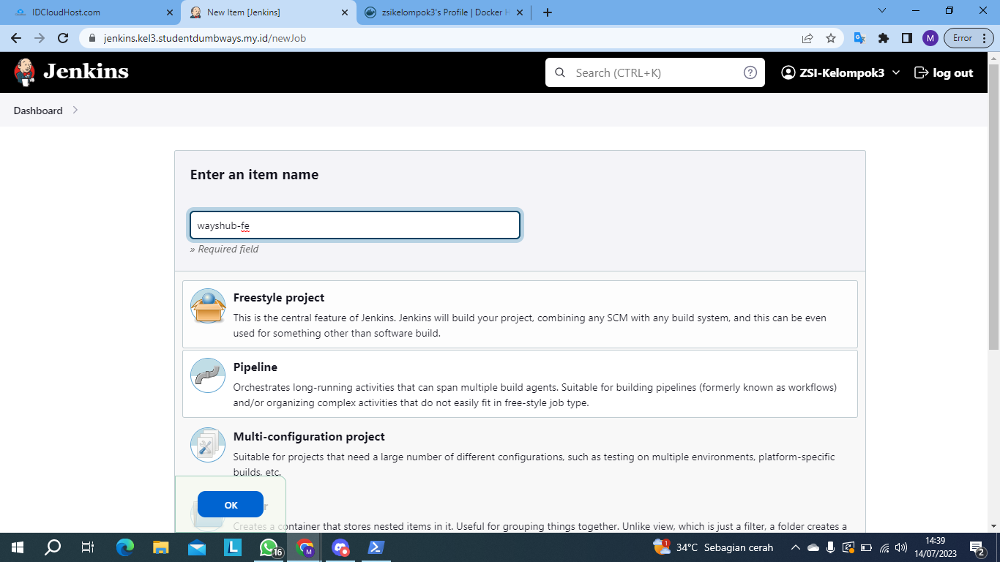
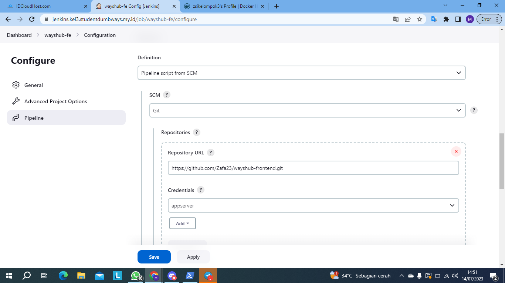
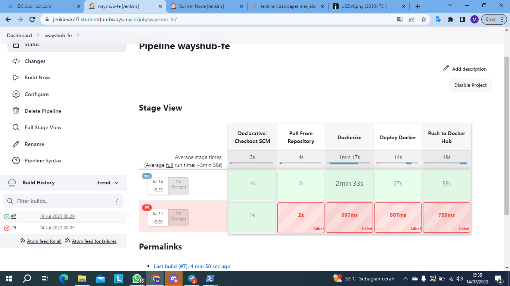
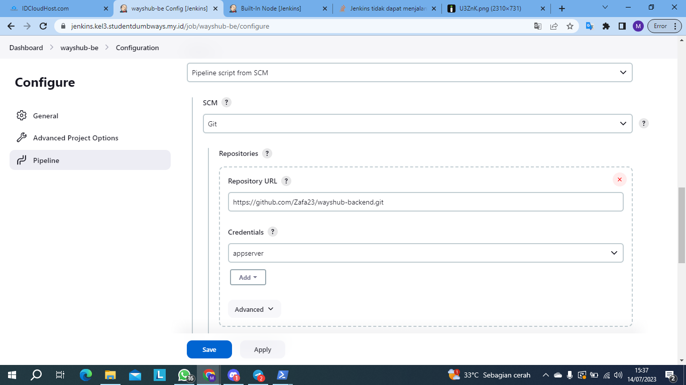
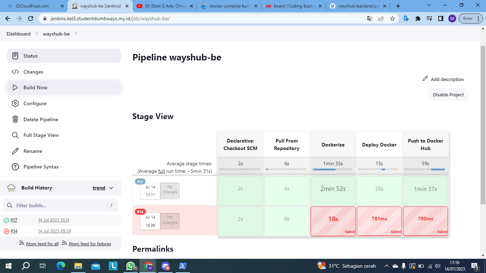
