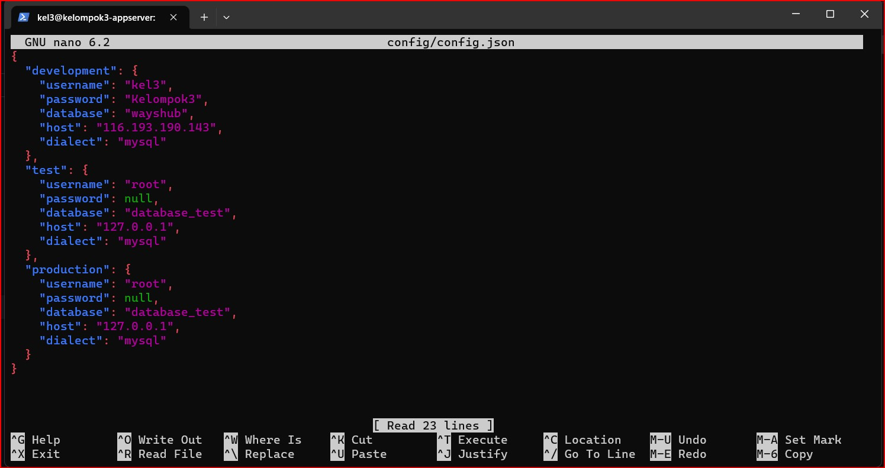
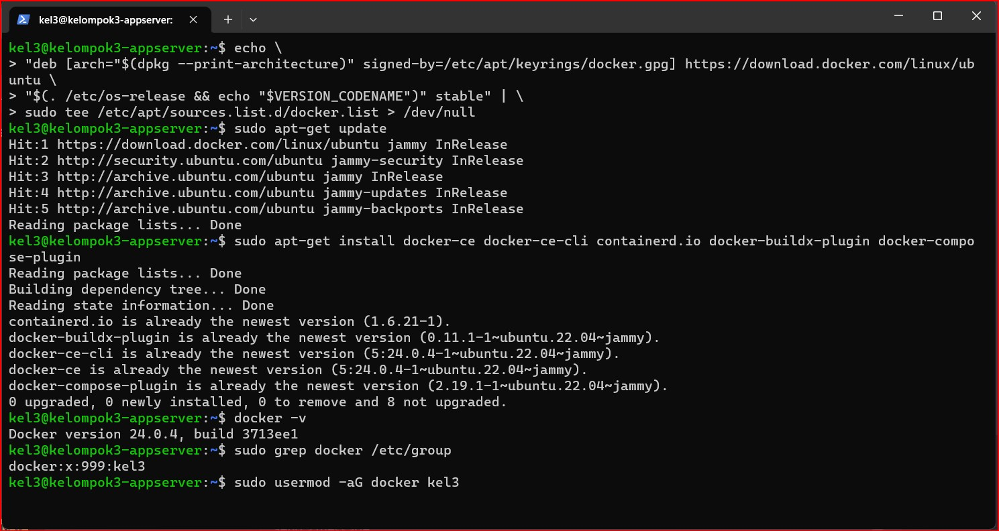

# Kelompok 3
Anggota
- Muhamad Abdul Zafar Assidiq
- Salman Alfarisi
- Muhammad Ilham 
***

# Docker 
Docker adalah platform perangkat lunak yang memungkinkan Anda untuk membuat, mengemas, dan menjalankan aplikasi secara konsisten di lingkungan yang terisolasi yang disebut "kontainer". Kontainer adalah unit terisolasi yang menjalankan perangkat lunak dan semua dependensinya, termasuk sistem operasi, perpustakaan, dan kode aplikasi. Docker memanfaatkan teknologi containerisasi yang sudah ada di dalam kernel Linux, seperti namespaces dan cgroups, untuk membuat dan mengelola kontainer.

## Requirements
- Buat 3 vm dengan spesifikasi sebagai berikut: 

| VM       | CPU     | RAM     | Storage |
|----------|---------|---------|---------|
| AppServer      | 2 Core  | 8 GB    | 100 GB  |
| Gateway        | 4 Core  | 16 GB   | 200 GB  |
| CI/CD          | 8 Core  | 32 GB   | 500 GB  |


# Setup Docker 
Hal pertama setelah membuat vm app server ikuti petunjuk disini [Docker](https://docs.docker.com/engine/install/ubuntu/)


```
sudo apt-get update
sudo apt-get install ca-certificates curl gnupg
```


> Jalankan perintah diatas ini atau bisa copy text nya 


> Step ke dua masukan gpg key nya kalian bisa copy di bawah ini

```
sudo install -m 0755 -d /etc/apt/keyrings
curl -fsSL https://download.docker.com/linux/ubuntu/gpg | sudo gpg --dearmor -o /etc/apt/keyrings/docker.gpg
sudo chmod a+r /etc/apt/keyrings/docker.gpg
```

> Buat seperti ini untuk menyiapkan repository nya, setelah membuat repository lakukan `sudo apt-get update`

```
echo \
  > "deb [arch="$(dpkg --print-architecture)" signed-by=/etc/apt/keyrings/docker.gpg] https://download.docker.com/linux/ubuntu \
  > "$(. /etc/os-release && echo "$VERSION_CODENAME")" stable" | \
  > sudo tee /etc/apt/sources.list.d/docker.list > /dev/null
```


> Baru disini instalasi docker dengan perintah 

```
sudo apt-get install docker-ce docker-ce-cli containerd.io docker-buildx-plugin docker-compose-plugin
```


> selanjutnya jalankan `docker -v` , kemudian setup untuk user root agar kita tidak perlu menggunakan sudo lagi saat menjalankan docker 

```
sudo usermod -aG docker (user)
```


> keterangan : perintah di atas ini adalah suatu perintah untuk mengizinkan user yang digunakan agar dapat menjalankan perintah docker tanpa menggunakan perintah sudo.